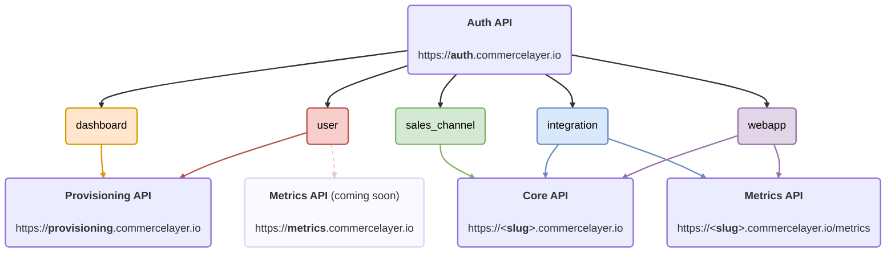

# Commerce Layer JS Auth

A lightweight JavaScript library designed to simplify [authentication](https://docs.commercelayer.io/developers/authentication) when interacting with the Commerce Layer API.

It works everywhere. On your browser, server, or at the edge.

## What is Commerce Layer?

[Commerce Layer](https://commercelayer.io) is a multi-market commerce API and order management system that lets you add global shopping capabilities to any website, mobile app, chatbot, wearable, voice, or IoT device, with ease. Compose your stack with the best-of-breed tools you already mastered and love. Make any experience shoppable, anywhere, through a blazing-fast, enterprise-grade, and secure API.

## Table of contents

- [Getting started](#getting-started)
  - [Installation](#installation)
- [Authorization flows](#authorization-flows)
- [Use cases](#use-cases)
  - [Sales channel application with client credentials flow](#sales-channel-client-credentials)
  - [Sales channel application with password flow](#sales-channel-password)
  - [Integration application with client credentials flow](#integration-client-credentials)
  - [Webapp application with authorization code flow](#webapp-authorization-code)
  - [Provisioning application](#provisioning)
  - [JWT bearer](#jwt-bearer)
  - [Revoking a token](#revoking-a-token)
- [Utilities](#utilities)
  - [Decode an access token](#decode-an-access-token)
  - [Verify an access token](#verify-an-access-token)
  - [Get Core API base endpoint](#get-core-api-base-endpoint)
  - [Get Provisioning API base endpoint](#get-provisioning-api-base-endpoint)
- [Contributors guide](#contributors-guide)
- [Need help?](#need-help)
- [License](#license)

---

## Getting started

To get started with Commerce Layer JS Auth, you need to install it and add it to your project.

[](https://www.npmjs.com/package/@commercelayer/js-auth)
[](https://jsr.io/@commercelayer/js-auth)

&nbsp;&nbsp;&nbsp;
[](https://discord.gg/commercelayer)

### Installation

Commerce Layer JS Auth is available as an npm package.

```bash
# npm
npm install @commercelayer/js-auth

# yarn
yarn add @commercelayer/js-auth

# pnpm
pnpm add @commercelayer/js-auth
```

## Authorization flows

To get an access token, you need to execute an [OAuth 2.0](https://oauth.net/2/) authorization flow by using a valid application as the client.

| Grant type             | Sales channel | Integration | Webapp |
| ---------------------- | :-----------: | :---------: | :----: |
| **Client credentials** | ✅            | ✅          |        |
| **Password**           | ✅            |             |        |
| **Refresh token**      | ✅            |             | ✅     |
| **Authorization code** |               |             | ✅     |
| **JWT bearer**         | ✅            |             | ✅     |

Check our [documentation](https://docs.commercelayer.io/developers/authentication) for further information on each single authorization flow.



## Use cases

Based on the authorization flow and application you want to use, you can get your access token in a few simple steps. These are the most common use cases:

- [Sales channel application with client credentials flow](#sales-channel-client-credentials)
- [Sales channel application with password flow](#sales-channel-password)
- [Integration application with client credentials flow](#integration-client-credentials)
- [Webapp application with authorization code flow](#webapp-authorization-code)
- [Provisioning application](#provisioning)
- [JWT bearer](#jwt-bearer)
- [Revoking a token](#revoking-a-token)

### Sales channel (client credentials)

Sales channel applications use the [client credentials](https://docs.commercelayer.io/developers/authentication/client-credentials) grant type to get a "guest" access token.

#### Steps

1. Create a **sales channel** application on Commerce Layer and take note of your API credentials (base endpoint, client ID, and the ID of the market you want to put in scope)

2. Use this code to get your access token:

```ts
import { authenticate } from '@commercelayer/js-auth'

const auth = await authenticate('client_credentials', {
  clientId: 'your-client-id',
  scope: 'market:code:europe'
})

console.log('My access token: ', auth.accessToken)
console.log('Expiration date: ', auth.expires)
```

### Sales channel (password)

Sales channel applications can use the [password](https://docs.commercelayer.io/developers/authentication/password) grant type to exchange customer credentials for an access token (i.e., to get a "logged" access token).

#### Steps

1. Create a **sales channel** application on Commerce Layer and take note of your API credentials (base endpoint, client ID, and the ID of the market you want to put in scope)

2. Use this code (changing user name and password with the customer credentials) to get the access token:

```ts
import { authenticate } from '@commercelayer/js-auth'

const auth = await authenticate('password', {
  clientId: 'your-client-id',
  scope: 'market:code:europe',
  username: 'john@example.com',
  password: 'secret'
})

console.log('My access token: ', auth.accessToken)
console.log('Expiration date: ', auth.expires)
console.log('My refresh token: ', auth.refreshToken)
```

Sales channel applications can use the [refresh token](https://docs.commercelayer.io/developers/authentication/refresh-token) grant type to refresh a customer access token with a "remember me" option:

```ts
import { authenticate } from '@commercelayer/js-auth'

const newToken = await authenticate('refresh_token', {
  clientId: 'your-client-id',
  scope: 'market:code:europe',
  refreshToken: 'your-refresh-token'
})
```

### Integration (client credentials)

Integration applications use the [client credentials](https://docs.commercelayer.io/developers/authentication/client-credentials) grant type to get an access token for themselves.

#### Steps

1. Create an **integration** application on Commerce Layer and take note of your API credentials (client ID, client secret, and base endpoint)

2. Use this code to get the access token:

```ts
import { authenticate } from '@commercelayer/js-auth'

const auth = await authenticate('client_credentials', {
  clientId: 'your-client-id',
  clientSecret: 'your-client-secret',
})

console.log('My access token: ', auth.accessToken)
console.log('Expiration date: ', auth.expires)
```

### Webapp (authorization code)

> Available only for browser applications

Webapp applications use the [authorization code](https://docs.commercelayer.io/developers/authentication/authorization-code) grant type to exchange an authorization code for an access token.

#### Steps

In this case, first, you need to get an authorization code, then you can exchange it with an access token:

1. Create a **webapp** application on Commerce Layer and take note of your API credentials (client ID, client secret, callback URL, base endpoint, and the ID of the market you want to put in scope)

2. Use this URL to authorize your webapp on Commerce Layer:

  ```bash
  https://dashboard.commercelayer.io/oauth/authorize?client_id={{your_client_id}}&redirect_uri={{your_redirect_uri}}&scope=market:id:xYZkjABcde&response_type=code&state=1a2b3c
  ```

3. Once you've authorized the application, you will be redirected to the callback URL:

   

   Use this code to get the access token:

  ```ts
  import { authenticate } from '@commercelayer/js-auth'

  const auth = await authenticate('authorization_code', {
    clientId: 'your-client-id',
    clientSecret: 'your-client-secret',
    callbackUrl: '<https://yourdomain.com/callback>',
    code: 'your-auth-code'
  })

  console.log('My access token: ', auth.accessToken)
  console.log('Expiration date: ', auth.expires)
  ```

### Provisioning

Provisioning applications use the [client credentials](https://docs.commercelayer.io/developers/authentication/client-credentials) grant type to get an access token.

#### Steps

1. Access your personal [provisioning](https://dashboard.commercelayer.io/user/provisioning_api) application on Commerce Layer dashboard and take note of your Provisioning API credentials (client ID, client secret)

2. Use this code to get the access token:

```ts
import { authenticate } from '@commercelayer/js-auth'

const auth = await authenticate('client_credentials', {
  clientId: 'your-client-id',
  clientSecret: 'your-client-secret'
})

console.log('My access token: ', auth.accessToken)
console.log('Expiration date: ', auth.expires)
```

### JWT bearer

Commerce Layer, through OAuth2, provides the support of token exchange in the _on-behalf-of_ (delegation) scenario which allows,
for example, to make calls on behalf of a user and get an access token of the requesting user without direct user interaction.
**Sales channels** and **webapps** can accomplish it by leveraging the [JWT Bearer flow](https://docs.commercelayer.io/core/authentication/jwt-bearer),
which allows a client application to obtain an access token using a JSON Web Token (JWT) [assertion](https://docs.commercelayer.io/core/authentication/jwt-bearer#creating-the-jwt-assertion).

#### Steps

1. Use this code to create an assertion:

```ts
const assertion = await createAssertion({
  payload: {
    'https://commercelayer.io/claims': {
      owner: {
        type: 'Customer',
        id: '4tepftJsT2'
      },
      custom_claim: {
        customer: {
          first_name: 'John',
          last_name: 'Doe'
        }
      }
    }
  }
})
```

2. Use this code to get the access token:

```ts
import { authenticate } from '@commercelayer/js-auth'

const auth = await authenticate('urn:ietf:params:oauth:grant-type:jwt-bearer', {
  clientId: 'your-client-id',
  clientSecret: 'your-client-secret',
  scope: 'market:code:europe',
  assertion
})

console.log('My access token: ', auth.accessToken)
console.log('Expiration date: ', auth.expires)
```

### Revoking a token

Any previously generated access tokens (refresh tokens included) can be [revoked](https://docs.commercelayer.io/core/authentication/revoking-a-token) before their natural expiration date:

```ts
import { revoke } from '@commercelayer/js-auth'

await revoke({
  clientId: 'your-client-id',
  clientSecret: 'your-client-secret',
  token: 'a-generated-access-token'
})
```

## Utilities

### Decode an access token

We offer an helper method to decode an access token. The return is fully typed.

> [!IMPORTANT]
> You should not use this for untrusted messages, since this helper method does not verify whether the signature is valid. If you need to verify the access token before decoding, you can use [`jwtVerify`](#verify-an-access-token) instead.

```ts
import { authenticate, jwtDecode, jwtIsSalesChannel } from '@commercelayer/js-auth'

const auth = await authenticate('client_credentials', {
  clientId: 'your-client-id',
  scope: 'market:code:europe'
})

const decodedJWT = jwtDecode(auth.accessToken)

if (jwtIsSalesChannel(decodedJWT.payload)) {
  console.log('organization slug is', decodedJWT.payload.organization.slug)
}
```

### Verify an access token

We offer an helper method to verify an access token. The return is fully typed:

```ts
import { authenticate, jwtVerify, jwtIsSalesChannel } from '@commercelayer/js-auth'

const auth = await authenticate('client_credentials', {
  clientId: 'your-client-id',
  scope: 'market:code:europe'
})

const decodedJWT = await jwtVerify(auth.accessToken, {
  ignoreExpiration: true
})

if (jwtIsSalesChannel(decodedJWT.payload)) {
  console.log('organization slug is', decodedJWT.payload.organization.slug)
}
```

### Get Core API base endpoint

Derive the [Core API base endpoint](https://docs.commercelayer.io/core/api-specification#base-endpoint) given a valid access token.

```ts
import { getCoreApiBaseEndpoint } from '@commercelayer/js-auth'

getCoreApiBaseEndpoint('a-valid-access-token') //= "https://yourdomain.commercelayer.io"
```

The method requires a valid access token with an `organization` in the payload. When the organization is not set (e.g., provisioning token), it throws an `InvalidTokenError` exception.

### Get Provisioning API base endpoint

It returns the [Provisioning API base endpoint](https://docs.commercelayer.io/provisioning/getting-started/api-specification#base-endpoint) given a valid access token.

```ts
import { getProvisioningApiBaseEndpoint } from '@commercelayer/js-auth'

getProvisioningApiBaseEndpoint('a-valid-access-token') //= "https://provisioning.commercelayer.io"
```

The method requires a valid access token (the token can be used with Provisioning API). When the token is not valid (e.g., core api token), it throws an `InvalidTokenError` exception.

---

## Contributors guide

1. Fork [this repository](https://github.com/BolajiAyodeji/commercelayer-js-auth) (learn how to do this [here](https://help.github.com/articles/fork-a-repo)).

2. Clone the forked repository like so:

```bash
git clone https://github.com/<your username>/commercelayer-js-auth.git && cd commercelayer-js-auth
```

3. Make your changes and create a pull request ([learn how to do this](https://docs.github.com/en/github/collaborating-with-issues-and-pull-requests/creating-a-pull-request)).

4. Someone will attend to your pull request and provide some feedback.

## Need help?

- Join [Commerce Layer's Discord community](https://discord.gg/commercelayer).
- Ping us on [Bluesky](https://bsky.app/profile/commercelayer.io), [X (formerly Twitter)](https://x.com/commercelayer), or [LinkedIn](https://www.linkedin.com/company/commerce-layer).
- Is there a bug? Create an [issue](https://github.com/commercelayer/commercelayer-js-auth/issues) on this repository.

## License

This repository is published under the [MIT](LICENSE) license.
