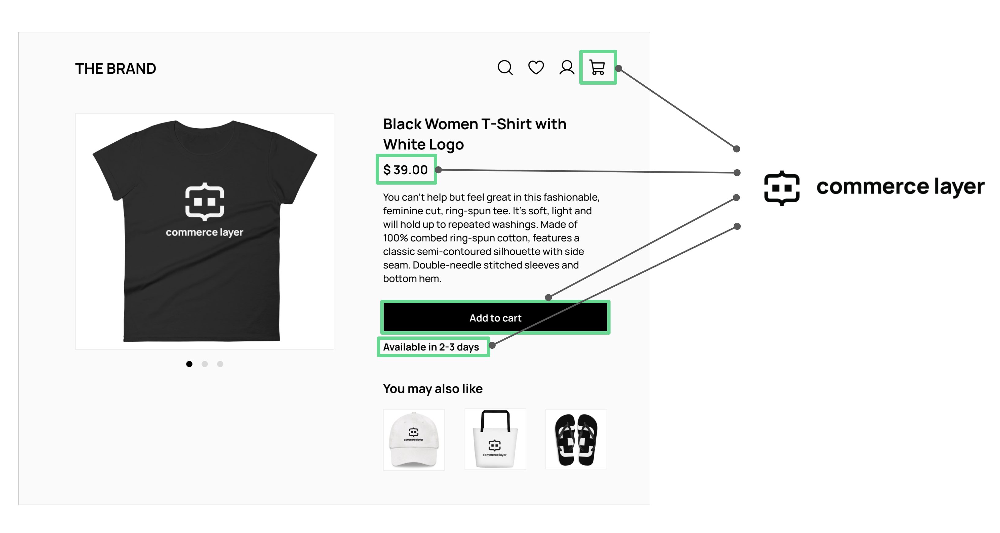

# drop-in.js

Commerce Layer drop-in.js lets you transform any plain HTML page into an enterprise-grade static commerce website, with almost no coding required. All you need to do is embed the library and add tags to the HTML page.

Prices, availability messages, shopping bag, and any other commerce functionality are automatically mixed into your own content and styling, whatever the CMS, SSG, and tools you use to build your site pages.

* **Price**  
  Display a price with localized currency, discounts, and personalization rules.

* **Availability**  
  Display an availability message with localized delivery lead time and cost.

* **Add to cart**  
  Add a buy button to any page with embedded validation rules.

* **Hosted cart**  
  Link or embed a hosted cart with line items preview and edit actions.

* **Hosted checkout**  
  Link to a hosted, PCI-compliant checkout with integrated payments.

[Getting started](https://commercelayer.github.io/drop-in.js)

## Need help?

- Join [Commerce Layer's Slack community](https://slack.commercelayer.app).
- Open a new [Q&A discussion](https://github.com/commercelayer/drop-in.js/discussions/categories/q-a)
- Ping us [on Twitter](https://twitter.com/commercelayer).
- Is there a bug? Create an [issue](https://github.com/commercelayer/drop-in.js/issues) on this repository.

## License

This project is published under the [MIT](https://github.com/commercelayer/drop-in.js/blob/main/LICENSE) license.
